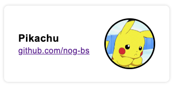
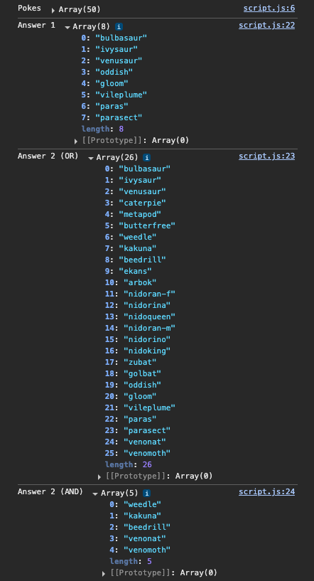

# Submission for ResponsiveAds

This project contains the following:
- JS: Find pokes by types
- HTML/CSS: Card design

## How to Run

1.  Clone the repo

2. Double click the `index.html` or `live-serve` the project

3.  **Check the Console:**
    -   Look here for any messages from the code in the developer console

## You Should Expect to See

## Thank you!
